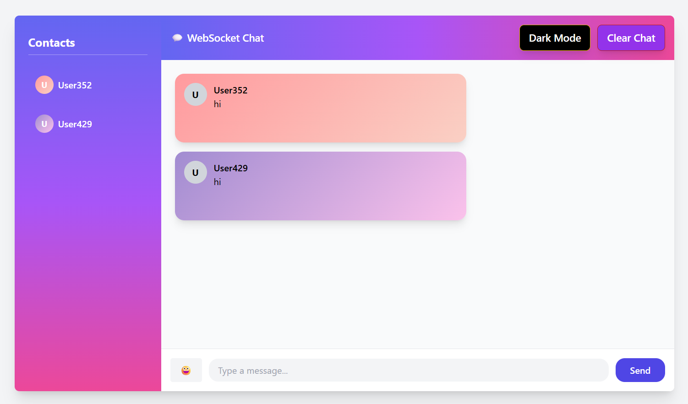
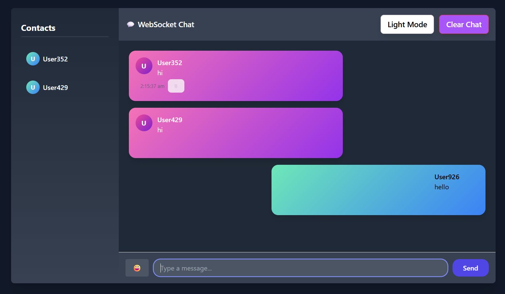
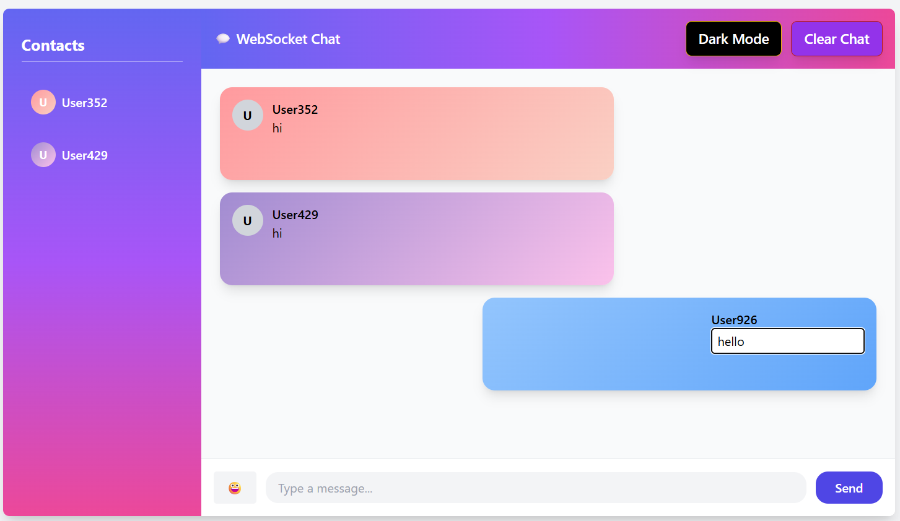
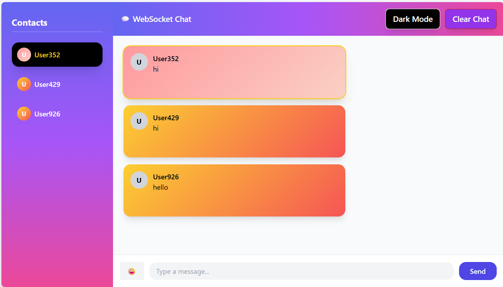

# 💬 Real-Time WebSocket Chat Application (Frontend)

A modern, responsive **real-time chat application* built using **React.js**, **WebSockets**, and **Tailwind CSS**.  
This project focuses on **production-ready UI/UX**, real-time interactions, message management, and theme customization.

-------------------------------------------------------------------------------------------------------------------------------------------------------------------

## 🚀 Features

### 🔹 Real-Time Chat
- ⚡ Real-time messaging using WebSockets
- 🧑‍🤝‍🧑 Multiple users with auto-generated usernames
- 🕒 Message timestamps
- 🔄 Automatic scroll to latest message

---

### ✏️ Message Management
- ✍️ Edit your own messages (double-click to edit)
- 🗑 Delete messages
- 📝 Edited messages are marked as **(edited)**
- ⌨️ Keyboard support:
  - `Enter` → Save edit
  - `Escape` → Cancel edit

---

### 🎨 UI / UX Enhancements
- 🌗 Dark mode / Light mode toggle
- 🎨 Dynamic gradient avatars for users
- 🧭 Sidebar with contact list
- 🔍 Highlight selected contact messages
- 🌀 Smooth transitions and animations
- 📱 Fully responsive layout

---

### 🧠 Smart Behaviors
- 🟢 Typing indicator
- 🧹 Clear chat with confirmation
- 💾 Chat persistence using `localStorage`
- 🚫 Duplicate message prevention

-------------------------------------------------------------------------------------------------------------------------------------------------------------------

## 📸 Screenshots / Demo

### 🔹 Light Mode

### 🔹 Dark Mode

### 🔹 Message Editing

### 🔹 Contacts Sidebar

--------------------------------------------------------------------------------------------------------------------------------------------------------------------

Tech Stack Used:

React.js – Frontend framework
WebSocket API – Real-time communication
Tailwind CSS – Styling and responsiveness
LocalStorage – Message persistence
Vite – Development and build tool

-------------------------------------------------------------------------------------------------------------------------------------------------------------------

📂 Project Structure

src/
 ├── Chat.jsx
 ├── App.jsx
 ├── main.jsx
 └── index.css

--------------------------------------------------------------------------------------------------------------------------------------------------------------------
⚙️ How It Works

A random username is generated on application load
The app connects to a WebSocket server
Messages are:
Sent and received via WebSocket
Stored in React state
Persisted in localStorage
UI updates in real time without page refresh
Users can edit or delete only their own messages

-------------------------------------------------------------------------------------------------------------------------------------------------------------------
🌐 WebSocket Server Used
wss://ws.ifelse.io

▶️ Run Locally
# Clone the repository
git clone https://github.com/your-username/your-repo-name.git

# Navigate to project folder
cd your-repo-name

# Install dependencies
npm install

# Start development server
npm run dev
-------------------------------------------------------------------------------------------------------------------------------------------------------------------
🔮 Future Enhancements

Emoji picker integration
Message reactions
Authentication (JWT / Firebase)
Private and group chats
File and image sharing
Backend integration using Socket.IO
-------------------------------------------------------------------------------------------------------------------------------------------------------------------
👨‍💻 Author

Ankit Yadav
Frontend Developer | React | WebSockets | Tailwind CSS
